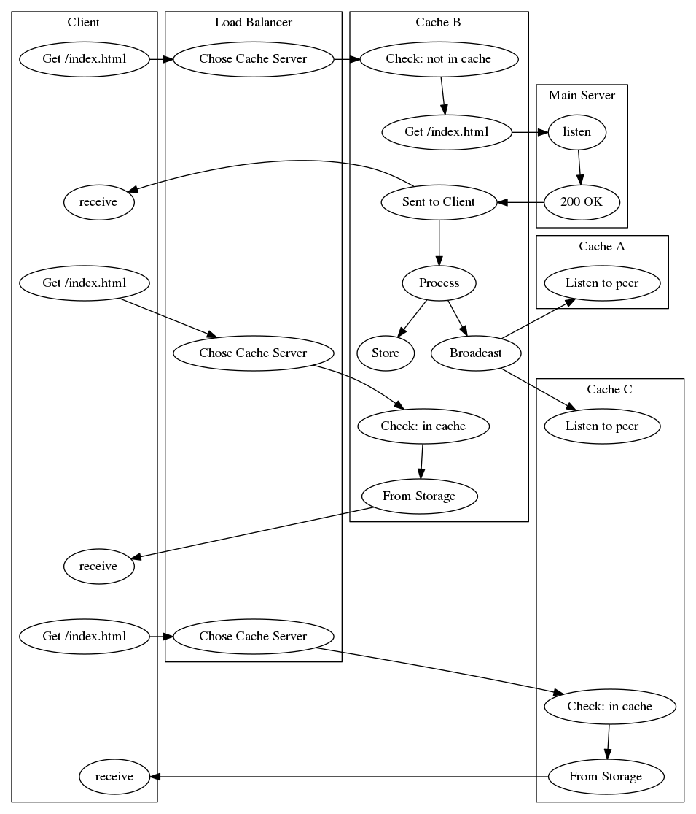

# Simple Cache in Python

## Cache server

This is a fork of Alexander Ellis https://github.com/AlexanderEllis simple cache server in python. 

He wrote about it [here](https://alexanderellis.github.io/blog/posts/simple-cache-server-in-python/).

## Fork features

This fork is an exercise on building a Python cache server that should have the following features:
1. Easy to configure and install
1. Expiry time
1. Distributed
1. Resilient
1. Geo distributed
1. LRU
1. Flexible schema

## Core concept

Here are the steps for the first time an item is requested:

1. Client requests item
2. Cache server checks if it's stored in the cache
3. The item is not found
4. The cache server requests the item from the main server
5. The main server sends the item back
6. The cache server saves a copy of the item
7. The cache server sends the client the item

We could definitely swap 6 and 7, especially if we're trying to send the item back to the client quickly.

Here's a diagram of a subsequent request for the same item:.

Here are the steps for the future request:

1. Client requests item
2. Cache server checks if it's stored in the cache
3. The item is found
4. The cache server sends the client the item

Although it looks like the main server is lonely to the right, it didn't have to worry about the client's request at all.  Lucky main server!

Here's another way of looking at the problem.  Here, the vertical axis is time increasing as you go down, and the horizontal arrows are the requests back and forth.  The same actions are taken in the same exact order, but the actions are separated vertically by when they happen:

## Usage

First, edit the config.py file to fit your needs. Set the host and port configurations appropriately.

Then, start your http server.

Then, start the cache proxy server:
`python3 main.py`

Then, navigate to appropriate URL and port.

Result:

## Distributed

### Discussion

One of the main features of the fork should be its distributed nature. The idea is to have several proxies distributed in different geographical regions in order to reduce latency.

LinkedIn conducted experiments on using Anycast to lower latency and ended up using Regional Anycast for North America and Europe:
https://engineering.linkedin.com/network-performance/tcp-over-ip-anycast-pipe-dream-or-reality

Although it seems to be clear that a mixture of Anycast and DNS based Load Balancing would be ideal, this project's requirements were clear enough about using the geographically closest cache server to answer requests. This is not possible with Anycast that uses the lower hop count to choose the Point of Presence and it neither guarantees that it will be closest nor tries to accomplish this. Although we cannot guarantee to use the closest server with DNS Load balancing, we can at least try.

